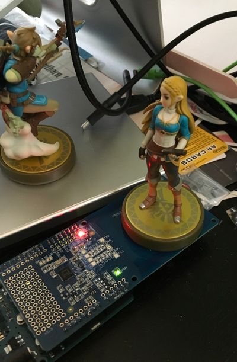

# Brian's Amiibo Development Resources

<https://github.com/BrianEnigma/Amiibo>

## Overview

This Amiibo development resource holds scripts for working with Amiibo NFC tags. This includes reading Amiibos with an Arduino, analyzing image files, and writing NTAG215 RFID modules with Amiibo backups.

## License

The code and documentation that I have written as part of this project are copyright 2017 Brian Enigma, and licensed under a [ Creative Commons Attribution-NonCommercial-ShareAlike 4.0 International License](http://creativecommons.org/licenses/by-nc-sa/4.0/). Other resources in this project are local mirrors of others' work and are owned by those individuals.

The tools in this project are for backing up, analyzing/understanding, and restoring your own Amiibo images. You will not find “backup” Amiibo images here.

## Prerequisites

The reader/writer hardware consists of:

- [Arduino Uno](https://www.adafruit.com/product/50)
- [Adafruit NFC/RFID Shield](https://www.adafruit.com/product/789)
    - This also requires you to install a corresponding [Arduino library](https://learn.adafruit.com/adafruit-pn532-rfid-nfc/arduino-library).
- [NTAG215 RFID tags](https://www.google.com/search?q=ntag215&oq=ntag215). These come in many forms, including stickers and rigid cards. Note that _*ONLY*_ the 215 model will work. 213 and 216 _*WILL NOT*_ work, as they are too small/large, and the Nintendo will know it because certain memory addresses will not align.

The Arduino software requires the Arduino IDE, and the knowledge of how to use it. The other tools are command-line Ruby scripts, which also require more than a passing familiarity with using command-line applications.

## Files/Folders

- [Arduino_Amiibo_Reader](./Arduino_Amiibo_Reader/) — Arduino application to read an Amiibo figure and display its hex dump on the serial monitor.
- [Images](./Images/) — A placeholder folder to put your `*.txt` (serial monitor copy/paste) and `*.bin` binary Amiibo images.
- [Scripts](./Scripts/) — A folder of Ruby scripts for working with Amiibo images,
    - [txt2bin.rb](./Scripts/txt2bin.rb) — Read a `*.txt` image and write a `*.bin` image.
    - [printbin.rb](./Scripts/printbin.rb) — Read a `*.bin` image and display analysis information. The analysis includes native RFID tag information (serial number, locked blocks, etc.) and some limited Amiibo information.
- [Specifications](./Specifications/)
    - [Amiibo_Character_Data.xlsx](./Specifications/Amiibo_Character_Data.xlsx) — A local copy of an [Amiibo Character Data Google Spreadsheet](https://docs.google.com/spreadsheets/d/1WJ4HxS9hkLquq-ATt1Rq9mioH6RDgP3qQrtYVaOdimM/edit?usp=sharing)
    - [NTAG213_215_216.pdf](./Specifications/NTAG213_215_216.pdf) — A local copy of the [NTAG215 data sheet](https://www.nxp.com/documents/data_sheet/NTAG213_215_216.pdf).
- [NOTES.md](NOTES.md) — My assorted notes about the RFID page format and tools.
